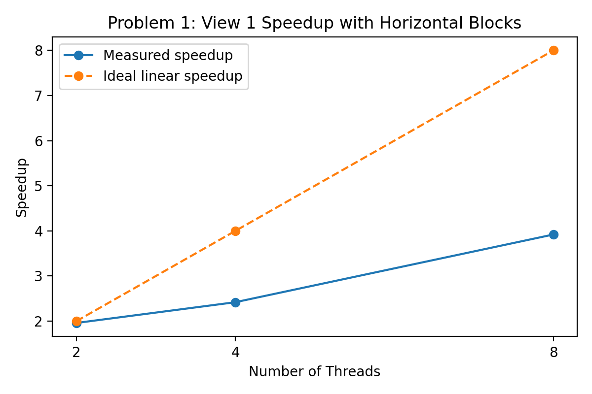

# Problem 1: Parallel Mandelbrot

## Initial Horizontal-Block Decomposition

Thread 0 handled the first block, thread 1 handled the second block, and so on. I also handled the case where the 900 rows were not evenly divisible by the number of threads by assigning the remaining rows to the final thread.

For view 1, the initial decomposition produced:

| Threads | Speedup |
|---:|---:|
| 2 | 1.96x |
| 4 | 2.42x |
| 8 | 3.92x |

Speedup is not linear. Scaling is nearly double with two threads, but does not grow linearly with four and eight threads.

A likely explanation is that equal-sized horizontal blocks do not contain equal amounts of computation, because different regions of the image require different numbers of iterations. If some threads finish much earlier than others, the overall execution time is determined by the slowest thread.

## Per-Thread Timing

To test this hypothesis, I measured the execution time of each worker thread.

For 2 threads:

| Thread | Time |
|---:|---:|
| 0 | ~117 ms |
| 1 | ~118 ms |

For 4 threads:

| Thread | Time |
|---:|---:|
| 0 | ~22.5 ms |
| 1 | ~94.5 ms |
| 2 | ~94.8 ms |
| 3 | ~22.8 ms |

For 8 threads:

| Thread | Time |
|---:|---:|
| 0 | ~3.7 ms |
| 1 | ~18.5 ms |
| 2 | ~37.9 ms |
| 3 | ~56.6 ms |
| 4 | ~57.4 ms |
| 5 | ~38.6 ms |
| 6 | ~19.5 ms |
| 7 | ~4.1 ms |

The timing measurements confirm that the current decomposition creates severe imbalance. With two threads, the two halves have nearly equal execution times, so speedup is close to 2x.

With four threads, the two central blocks take roughly 94–95 ms while the outer blocks take only about 22–23 ms. With eight threads, execution times range from about 4 ms for the outermost blocks to about 57 ms for the central blocks.

Since the overall computation cannot complete until the slowest thread finishes, many cores sit idle after completing their assigned blocks. This explains why speedup increases from only 2.42x with four threads to 3.92x with eight threads.

## Improved Decomposition

To improve load balance, I changed the decomposition from contiguous horizontal blocks to interleaved rows. For `T` threads, thread `t` processes rows t, t + T, t + 2T, ...

This distributes rows from different parts of the image across all threads, so each thread receives a mixture of expensive and inexpensive rows.

For view 1, the improved implementation achieved:

| Threads | Speedup |
|---:|---:|
| 2 | 1.96x |
| 4 | 3.85x |
| 8 | 7.60x |

Final 8-thread speedup:

- View 1: **7.60x**